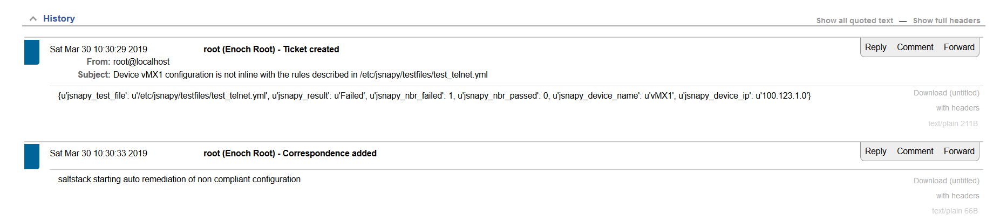

# Repository description 

This repository is about **auto remediation** of non compliant configuration  

This repository uses Junos devices, SaltStack, JSNAPy and Request Tracker.  

At each Junos commit, SaltStack is notified with a syslog message, and runs a JSNAPy test to audit the new Junos configuration.  
If the Junos configuration is not compliant with the JSNAPy rules, SaltStack updates the ticketing system (Request Tracker) with this issue, and fixes the issue and reports this activity on the ticketing system.  
The ticket id is indicated in the Junos commit message.  

Visit [**wiki**](https://github.com/ksator/auto_remediation_of_non_compliant_configuration/wiki) for instructions  
  
Example: 

configure telnet on a Junos device
```
$ ssh jcluser@100.123.1.0
Password:
Last login: Sat Mar 30 13:44:53 2019 from 100.123.35.0
--- JUNOS 17.4R1-S2.2 Kernel 64-bit  JNPR-11.0-20180127.fdc8dfc_buil
jcluser@vMX1>

jcluser@vMX1> edit
Entering configuration mode

[edit]
jcluser@vMX1# set system services telnet

[edit]
jcluser@vMX1# commit and-quit
commit complete
Exiting configuration mode
```

SaltStack received the syslog commit message, and runs a JSNAPy test to audit the new Junos configuration.  
Telnet is not allowed. The new Junos configuration is not compliant with the JSNAPy rules. The JSNAPy test fails.  
SaltStack updates the ticketing system (Request Tracker) to report this issue.  

  

Then, SaltStack fixes this issue, and reports this new activity on the ticketing system.   
  

The ticket id is indicated in the Junos commit message.  

```
jcluser@vMX1> show system commit
0   2019-03-30 14:30:31 UTC by jcluser via netconf
    configured with SaltStack using the delete_telnet.xml file to remove telnet configuration due to ticket 1
1   2019-03-30 14:30:19 UTC by jcluser via cli
```
```
jcluser@vMX1> show configuration | compare rollback 1
[edit system services]
-    telnet;
```

**So, in few seconds only, the new issue has been automatically detected, reported, and fixed**  
